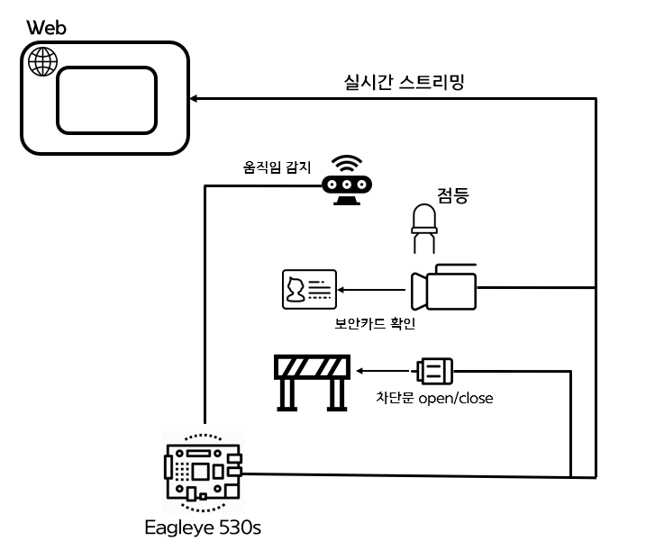
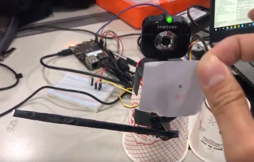
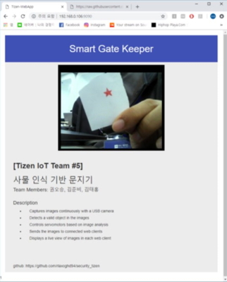

# security-entrance-tizen-app
타이젠을 이용한 보안 차단문 IoT

## 1. Project Overview 
+ ### Background 
  * 오픈 소스 프로젝트를 확인해보니 카메라, LED, 서보모터, PIR, CO2 센서를 이용한 프로젝트였습니다. 
  이 프로젝트를 활용하여 만들 수 있는 주제를 생각해 보았는데 처음엔 시각장애인을 위한 지팡이를 생각하였습니다.
  하지만 1박2일로 개발하기에는 시간이 부족할 것이라고 판단하고 보안 차단문으로 주제를 변경하였습니다.

+ ### Project Purpose
  * [오픈 소스 프로젝트](https://github.com/tizen-github/smart-blackbox)를 활용하여 IoT 구현
  * 카메라로 이동물체 추적 및 정확도 고려
  
+ ### Project Goal
  * PIR센서로 차단문에 가까이 왔는 지 확인하고 가까이 왔을 때 LED를 켠다.
  * LED가 켜져 있는 동안 카메라가 보안카드를 확인한다.
  * 보안 카드가 승인된 카드가 맞다면 서보 모터를 이용하여 차단문을 올려준다.
  * 일정 시간이 지나면 차단문을 다시 내려준다.
  * 카메라가 찍고 있는 화면을 실시간으로 WEB에 전송하여 스트리밍한다.
  
## 2. Development environment
+ ### Server
  * Mac OS X 
+ ### Client
  * Eagleye530s
  * TIZEN 4.0
  
## 3. Language/DB
+ ### Server
  * Node.js
+ ### Client
  * TIZEN C
  
## 4. Project Architecture & Design
+ ### Architecture
   
+ ### Design
   
   
   
## 5. Function Description
+ ### Artic
  * 모터, 카메라, LED, PIR 센서는 오픈 소스 프로젝트를 활용해 모듈 코드를 직접 구현하지 않음
+ ### Web
  * 현재 카메라가 찍은 화면을 실시간으로 캡쳐하여 저장하고 Web에서는 계속 이미지를 로드하는 방식으로 스트리밍
+ ### Image Recognition
  * TIZEN 내부에 OpenCV 기반 Media Vision Image API를 이용
  * mv_image_recognize()에서 호출하는 _on_image_recognized_cb() 콜백 함수를 수정하여 사용

## 6. Video
  * [URL](https://www.youtube.com/watch?v=ZFVuHHsI1uE)
